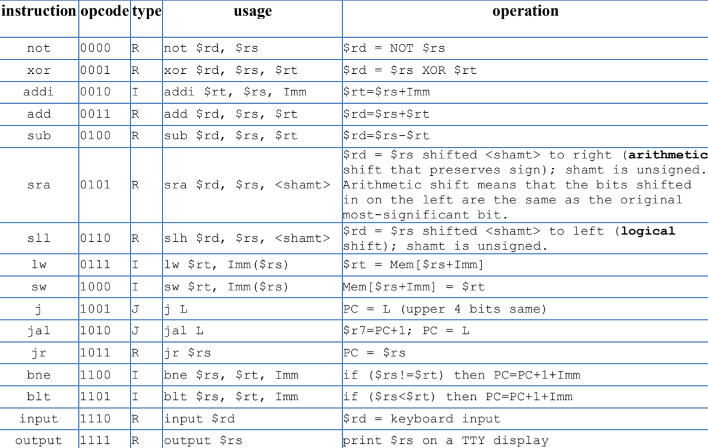
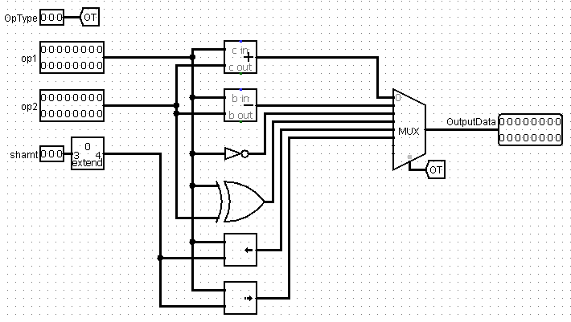
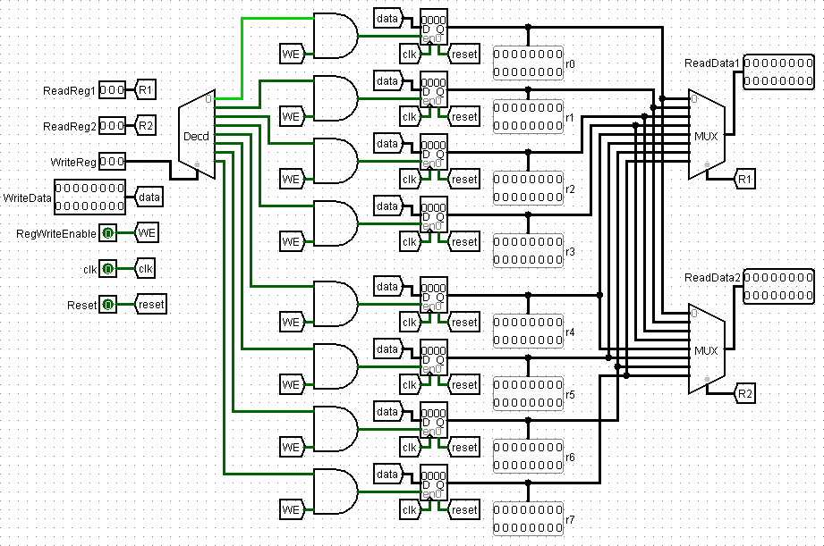
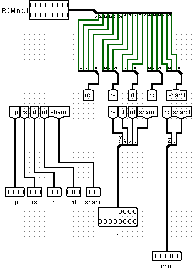
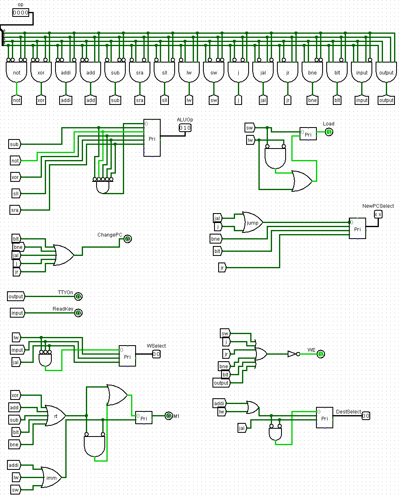

# Homework 2: Processor Core Design
## ***COMPSCI250: Computer Architecture***
#### Note: z2017g is my old GitHub account that was used for schoolwork. 
## Supported Instructions

## [Logisim](http://www.cburch.com/logisim/download.html) Circuit Files
### *The following circuits are all subcircuits of hw4.circ. They are not visible in a file manager; they must be viewed using Logisim. A Logisim component reference can be found [here](http://www.cburch.com/logisim/docs/2.5.0/en/libs/index.html)*.
### main
* This subcircuit connects together the other subcircuits discussed below and provides a high-level perspective of the entire processor. 

### ALU
* This subcircuit is a 16-bit arithmetic logic unit (ALU). It supports 
  * addition 
  * subtraction 
  * NOT
  * XOR
  * shift left logical
  * shift right arithmetic

* 
### RegisterFile
* This subcircuit is the register file containing registers r0-r7.
* 

### InstrDecoder
* This subcircuit is the instruction decoder that breaks down a 16-bit input from the ROM into the fields appropriate for the particular instruction format that is being used in that instance. 
* 
### Control
* This subcircuit acts as the control scheme that sets the value of MUX control signals and other control signals in main to the values that correspond to the particular instruction being executed. 
* 

